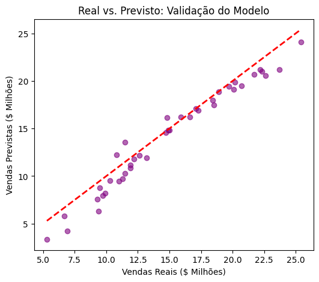
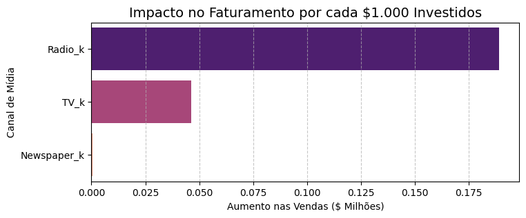

# Marketing Mix Modeling (MMM): Otimização de Investimento em Mídia

"Como aumentar o faturamento em 25% sem aumentar um centavo no orçamento de marketing?"

Este projeto aplica técnicas de Ciência de Dados e Modelagem Estatística para mensurar a eficiência de diferentes canais de mídia (TV, Rádio e Jornal) e otimizar a distribuição de verba publicitária para maximizar as vendas.

## Objetivo de Negócio

O foco é sair da intuição e utilizar dados para responder:
1. Qual o impacto real de cada canal no faturamento final?
2. Quanto venderíamos organicamente sem nenhum investimento?
3. Qual a estratégia ideal de realocação de verba para aumentar o ROI?

## Performance do Modelo

O modelo de Regressão Linear Multivariada foi validado com métricas de alta precisão:
- R² Score: 0.9338 (O modelo explica 93% das variações nas vendas).
- RMSE: 1.32 (Erro médio baixo em relação à escala de milhões das vendas).
- Vendas Base (Intercepto): $2.64M (Volume de vendas orgânicas/força da marca).

## Insights e Decisões Baseadas em Dados (Data-Driven)

A análise dos coeficientes revelou uma discrepância clara na eficiência dos canais:
- TV e Rádio: Apresentaram altíssima correlação e previsibilidade. São os motores de crescimento do mix.
- Jornal (Newspaper): Apresentou impacto marginal próximo de zero e alta dispersão de dados (baixa confiabilidade).

## Simulação de Cenário "What-If"

Realizei uma simulação onde a verba do canal Jornal foi totalmente zerada e redistribuída igualmente entre TV e Rádio.
- Faturamento Médio Atual: $13.86M
- Faturamento com Verba Realocada: $17.43M
- Impacto Estimado: + $3.58M de aumento no faturamento (+25.81%) sem necessidade de aporte extra de capital.

## Validação Estatística e Trabalhos Futuros

Para aferir a confiabilidade da inferência dos coeficientes (Teste-t), os resíduos do modelo foram submetidos ao Teste de Shapiro-Wilk. 
O teste retornou um p-valor inferior a 0.05, indicando que os erros não possuem distribuição perfeitamente Normal. 

Isso sugere que, embora o poder de previsão global do modelo seja muito alto (R² de 93%), a atribuição exata do mérito de cada mídia possui ressalvas matemáticas. Como a regressão linear simples assume retornos constantes, falha em capturar o limite de saturação do mercado (retornos decrescentes). 

Como próximos passos para uma segunda versão do modelo (V2), planeja-se a aplicação de Transformações Logarítmicas nas variáveis financeiras para corrigir a normalidade dos resíduos e simular o teto de saturação, além de explorar técnicas avançadas como Regressões Robustas (Ridge/Lasso) ou Inferência Bayesiana.

## Stack Tecnológico
- Linguagem: Python
- Bibliotecas: Pandas, NumPy, Scikit-Learn, SciPy
- Visualização: Seaborn, Matplotlib
- Conceitos Aplicados: Regressão Linear, Divisão Treino/Teste, Teste de Hipótese (Shapiro-Wilk), Engenharia de Variáveis e Análise de ROI.

## Dados

Fonte: Advertising Sales Dataset – Kaggle
Arquivo utilizado: Advertising-Budget-and-Sales.csv

Principais colunas:
- TV Ad Budget ($) – investimento em TV ($1k)
- Radio Ad Budget ($) – investimento em Rádio ($1k)
- Newspaper Ad Budget ($) – investimento em Jornal ($1k)
- Sales ($) – vendas/receita ($1M)
